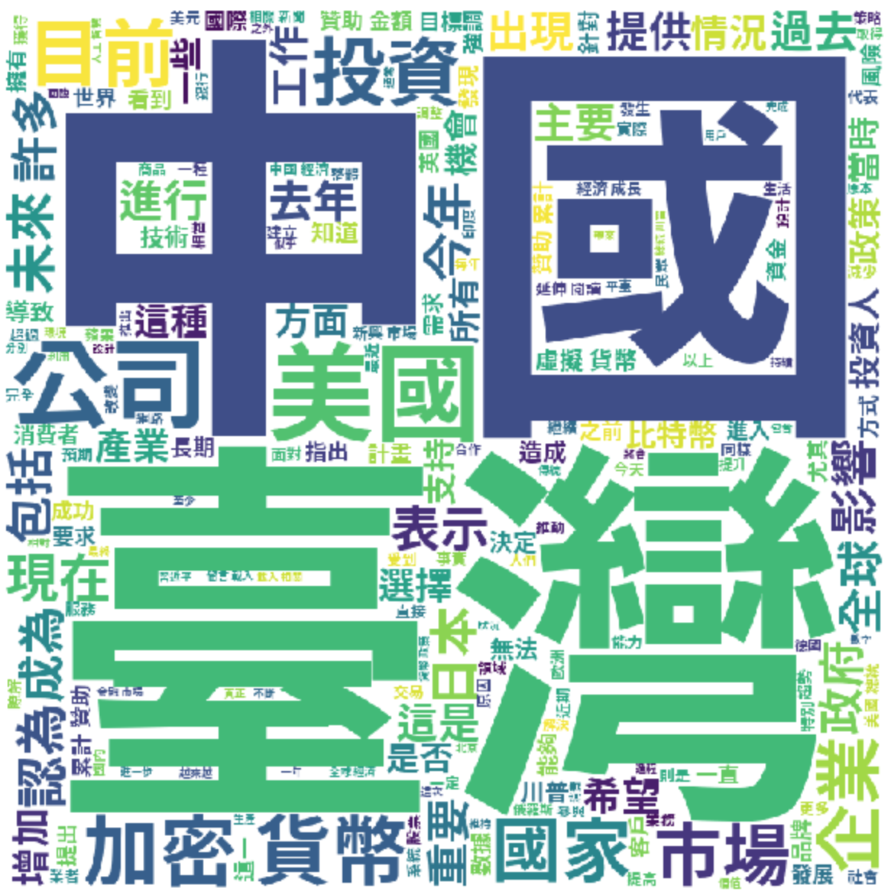
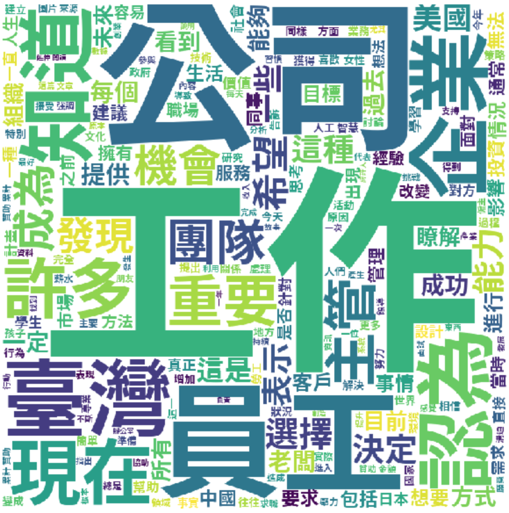

# Cupoy - 文章新聞分類(by 陳育偉)
## 一、檔案結構
| 目錄                               | 檔案                                                                                                 | 說明                                   |
| ---------------------------------- | ---------------------------------------------------------------------------------------------------- | -------------------------------------- |
| ./preprocessing                    | <a href="./preprocessing/01_TraditionalChiniese.ipynb">01_Traditional Chiniese.ipynb</a>                                            | 文章簡中轉繁中處理                          |
| ./preprocessing                    | <a href="./preprocessing/02_WorldCloud.ipynb">02_WorldCloud.ipynb</a>                                | 14個標籤文字雲處理 |
| ./singleLabel_model                    | <a href="./singleLabel_model/03_word2vec_wiki_Singlelabel dataset.ipynb">03_word2vec_wiki_Singlelabel dataset.ipynb</a>                 | Single Label 的二元分類器       |
| ./multiLabel_model                     | <a href="./multiLabel_model/04_word2vec_wiki_Multilabel dataset.ipynb">04_word2vec_wiki_Multilabel dataset.ipynb</a>                              | Multi label分類器訓練                  |

## 二、資料探索
#### 讀取原始文件，製作14個文字雲，擷取前頻率前200的字納入雲中：
2.1 label 0 :區塊鏈技術

  

2.2 lablel 1: 蘋果專區

  

2.3 label 2: 醫療健康

  

2.4 label 3: 美妝保養

  

2.5 label 4: 汽車

  

2.6 label 5: 美食

  

2.7 label 6: 理財

  

2.8 label 7: 房地產

  

2.9 label 8: 財經

  

2.10 label 9: 旅遊

  

2.11 label 10: AI與大數據

  

2.12 label 11: 職涯

  

2.13 label 12: 3C產品

  

2.14 label 13: 無人駕駛

  

1. 在美食與旅遊文章標籤下的文章內容，最常出現的字眼除了台灣，就是日本
2. 在財經方面，仍然可以發現，與中國的互動頻繁，美國出現的頻率也沒這麼高

  

## 三、實驗結果
#### 使用Wikipedia中文的Word2Vec預訓練資料集，針對資料先進行Word2Vec後，丟入XGBoost模型中進行訓練：
1. 二元分類:
accuracy: 97.5%
hamming lost: 2.4%
資料未進行oversampling，所以效果可能會受到影響。
2. 多標籤分類
accuracy: 67.1%
hamming lost: 3.1%

